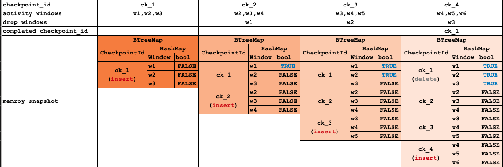

## Checkpoint简介

* `Checkpoint`用于实现分布式快照，由`Barrier`事件周期性触发进行快照
* 每个算子都可以进行快照
* rlink中快照的元数据内容用`CheckpointHandle`封装，里面很简单就一个handle字符串熟悉，在rlink中，快照元数据尽量简单,目前支持的存储是mysql
* rlink支持`Completed Checkpoint`，实现无状态下至少一次性

## Completed Checkpoint

每个算子的`Checkpoint`中都包含`completed_checkpoint_id`字段，他表示在当前checkpoint触发时，之前的某次checkpoint已经完整输出了。
这里的完整输出主要应用在窗口计算场景，Reduce算子的之前某个最近的Checkpoint时的窗口已经全部输出，则记录这个最近的`checkpoint_id`为当前的`completed_checkpoint_id`，
而Reduce算子在快照时，不需要对state进行存储，重启时从`completed_checkpoint_id`开始即可，保证至少一次输出而避免state存储，
结合rust高效内存管理，大部分无状态场景可以实现全内存计算

示例： 存在连续一组checkpoint中，每次checkpoint事件时的窗口状态

| checkpoint | active windows | completed windows | completed checkpoint_id |
| ---------- | -------------- | ----------------- | ----------------------- |
| ck_1       | w1, w2, w3     |                   |                         |
| ck_2       | w2, w3, w4     | w1                |                         |
| ck_3       | w3, w4, w5     | w1, w2            |                         |
| ck_4       | w4, w5, w6     | w1, w2, w3        | ck_1                    |

从触发ck_1开始，到触发ck_4截止，内部的存储变化如图：

运行期completed处理逻辑：
1. 内存中维护一个两层map。
2. 每次触发窗口drop时，在map中找到自身，并标记value为true。
3. 当触发checkpoint时（假设为ck_n)
   1. 把当前的活动窗口插入到map中，value为false。
   2. 遍历map检查是否存在所有窗口都已经drop的checkpoint_id
   3. 如果找到（假设为ck_m），把ck_m标记为ck_n的completed_checkpoint_id

所以在ck_n触发时，发现之前ck_m时候的所有的active windows都已经完成drop输出；所以在ck_n完成后发生重启，计算任务会应用ck_m的快照数据，
并且对ck_m时存在的active windows进行丢弃（因为在重启时，这些窗口数据已经不完整了）

所以任务重启逻辑为：
1. 加载最后一次完整checkpoint的快照信息
2. 在快照信息里统计`min(completed_checkpoint_id)`(`completed_checkpoint_id > 0`)
3. 如果存在`completed_checkpoint_id`，则用`completed_checkpoint_id`作为`checkpoint_id`条件进行重新加载快照信息
4. 如果不存在，则直接应用当前快照信息进行重启，窗口计算场景则会丢失数据

限制：
* 不能应用于有状态计算，比如全局计数统计等
* 窗口计算场景重启必须要经历一次`completed checkpoint_id`， 才能实现至少一次性
