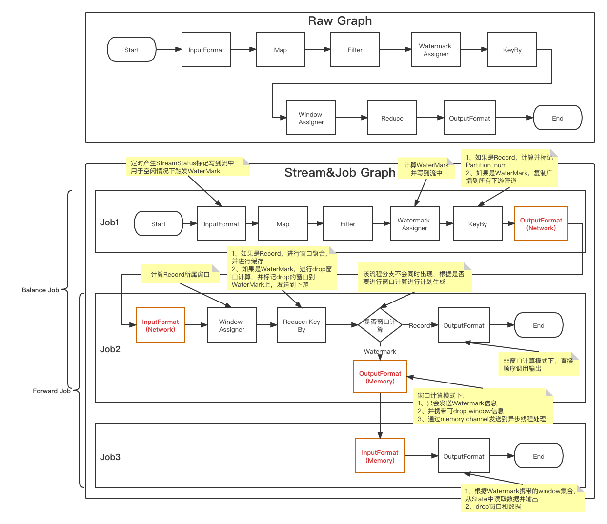
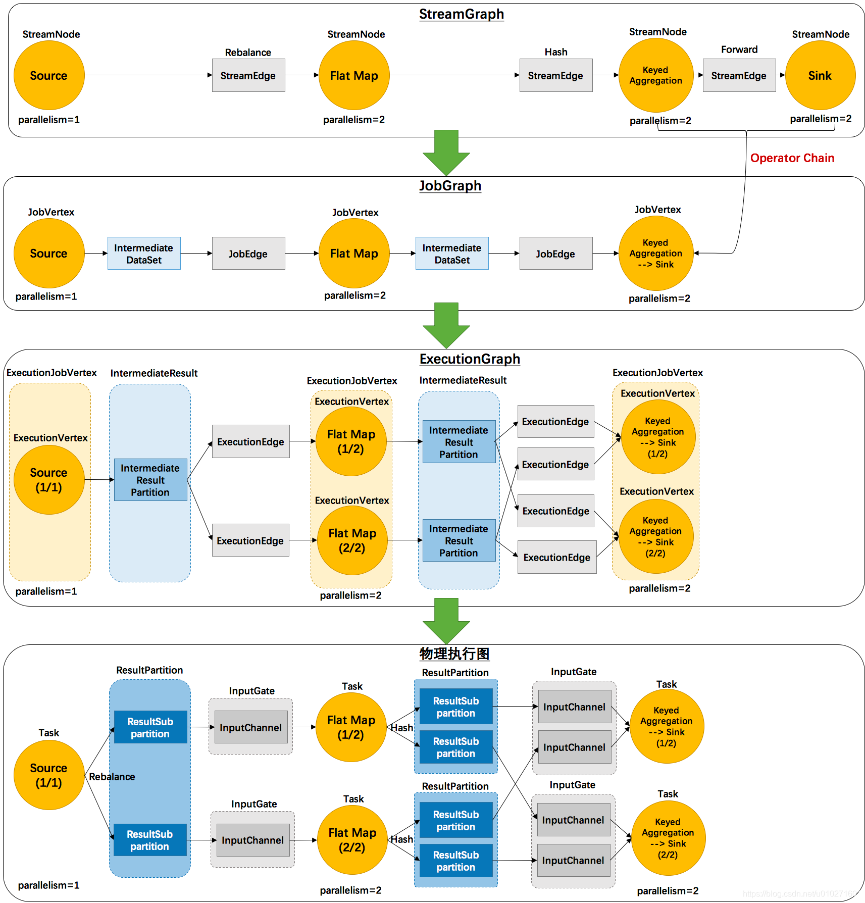

## rlink执行计划涉及概念

rlink会根据StreamGraph生成JobGraph，而job规定必须要有Source和Sink，所以在StreamGraph构建期间就会自动补全内置的Source和Sink。
rlink中内置的Source和Sink分别为 `SystemInputFormat`, `SystemOutputFormat`，用来处理Job间数据传输，
Job间数据采用发布订阅方式，通过`ChannelKey`标识一个管道资源。`ChannelKey`定义如下
```rust
pub(crate) struct ChannelKey {
    pub(crate) source_task_id: TaskId,
    pub(crate) target_task_id: TaskId,
}
pub struct TaskId {
    pub(crate) job_id: JobId,
    pub(crate) task_number: u16,
    pub(crate) num_tasks: u16,
}
```

发布订阅管道的实现分为两类：
* memory: 通过内存方式传输数据
* network: 通过网络方式传输数据

`SystemInputFormat`和`SystemOutputFormat`跟进Job依赖类型决定使用哪种发布订阅实现。
所以在计算引擎运行时上，只负责Job的调度执行，不关心数据流转方式，因为数据流转也是一种算子。

### 算子
最小计算单元，应用于对流进行转换操作

### StreamGraph
根据用户的算子编排，生成的拓扑图。

#### StreamNode
包装算子

#### StreamEdge
算子间依赖关系

### JobGraph
根据StreamGraph进行解析，进行执行管道划分，依赖行为指定

#### JobNode
JobGraph解析出来的每一个管道构成一个JobNode，每个JobNode必须以Source开始和以Sink算子结束(JobGraph解析时会自动构建缺失的Source和Sink)

#### JobEdge
Job间的依关系：Forward, Balance
Forward: 两个job必须在同一个进程内，并行度一致，串行且通过MemoryIO进行输出流转
Balance: 上游job通过hash把数据发送到下游job，数据流转通过NetIO进行

### ExecutionGraph
根据JobGraph生成Task级别的依赖拓扑图

### PhysicGraph
物理执行计划，根据ExecutionGraph按资源分配进行任务分配

## 对比下rlink-rs和Apache Flink的执行计划差异
示例：滑动窗口计算示例：60s窗口，20s滑动，数据延迟等待1s
```rust
env.register_source(RandInputFormat::new(), 3)
    .flat_map(MyFlatMapFunction::new())
    .assign_timestamps_and_watermarks(BoundedOutOfOrdernessTimestampExtractor::new(
        Duration::from_secs(1),
        SchemaBaseTimestampAssigner::new(model::index::timestamp, &FIELD_TYPE),
    ))
    .key_by(key_selector)
    .window(SlidingEventTimeWindows::new(
        Duration::from_secs(60),
        Duration::from_secs(20),
        None,
    ))
    .reduce(reduce_function, 2)
    .add_sink(PrintOutputFormat::new(output_schema_types.as_slice()));
```

#### rlink-rs
**关注下红色标注的矩形节点，由StreamGraph构建时填充**
ExecutionGraph和物理执行计划和Apache Flink类似



#### Apache Flink
